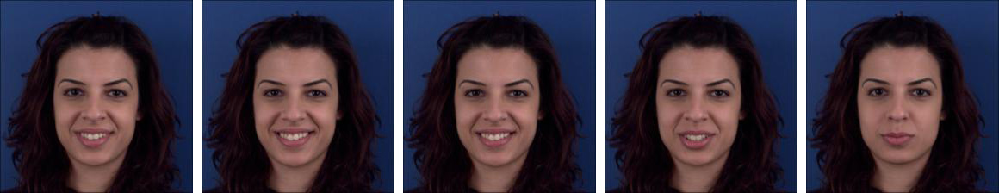

# MUG-FER
*_Facial emotion recognition on the MUG dataset_*

## Data
The [MUG Facial Expression Database](https://mug.ee.auth.gr/fed/) consists of image sequences of 52 subjects performing facial expressions. This dataset contains 7 basic emotions (anger, disgust, fear, happiness, sadness, surprise, neutral), and each image sequences start and end at the neutral state.

As an input for our all models, we selected only 5 frames for each image sequence. One such sample is shown here for reference.

## Models created
| Model                  | Accuracy | Inference time (ms) |
|------------------------|:--------:|:-------------------:|
| **VGG-LSTM**           |   86.4%  |          ?          |
| **VGG-SIFT-LSTM**      | **95.5%**|          ?          |
| **DenseNet-LSTM**      |   84.5%  |          ?          |
| **DenseNet-SIFT-LSTM** |   94.2%  |          ?          |

#### VGG-LSTM
Here we add a simple LSTM network on top of a pretrained [VGG-16](https://arxiv.org/abs/1409.1556) model that uses the [VGG-Face](http://www.robots.ox.ac.uk/~vgg/software/vgg_face/) weights. We take as input of our LSTM network the 5 outputs at the fc7 layer (dimension 4096) of the 5 frames from the image sequence. The LSTM network consist of a single LSTM layer of 32 units, followed by two fully-connected layers of 16 and 7 units respectively, both preceded by a dropout layer.

#### VGG-SIFT-LSTM
This model is similar to VGG-LSTM, except that we also give as input of our LSTM network the SIFT descriptors of the 51 facial landmarks of each of the 5 frames. The facial landmarks are first detected using dlib and OpenCV, then the SIFT descriptors of each of the 51 landmarks are extracted. Note that we do not use the facial landmarks that lie on the border the face, as they are irrelevant for FER. Thus we use 51 landmarks instead of the 68 that dlib detects. These can be seen below.

#### DenseNet-LSTM
This model is the same as VGG-LSTM, except that we use [DenseNet-121](https://arxiv.org/abs/1608.06993) instead of VGG-16. We use the output after the 7x7 glabal average pooling layer, which has dimensionality 1024.

#### DenseNet-SIFT-LSTM
This model is the same as VGG-SIFT-LSTM, except that we use DenseNet-121 instead of VGG-16.

## How to use

The code files are organized as follows:

Main training files:
- **vgg_lstm.py** - Run this to train the VGG-LSTM model
- **vgg_sift_lstm.py** - Run this to train the VGG-SIFT-LSTM model
- **densenet_lstm.py** - Run this to train the DenseNet-LSTM model
- **densenet_sift_lstm.py** - Run this to train the DenseNet-SIFT-LSTM model

Auxiliary files:
- **extraction.py** - Everything related to data extraction
- **training.py** - Everything related to model training
- **plot.py** - Everything related to plotting
- **sift.py** - Everything related to SIFT descriptors and facial landmarks extraction
