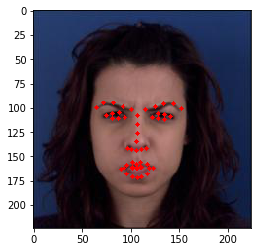
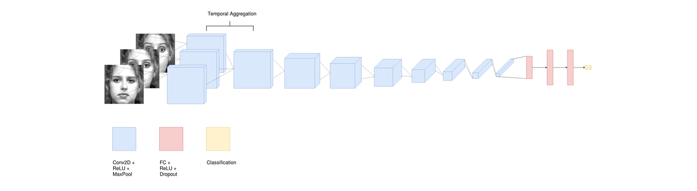
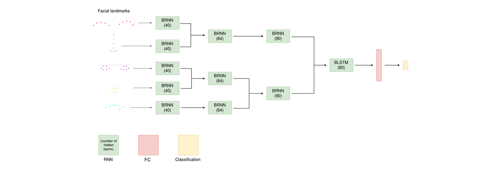

# MUG-FER
*_Facial emotion recognition on the MUG dataset_*

## Data
The [MUG Facial Expression Database](https://mug.ee.auth.gr/fed/) consists of image sequences of 52 subjects performing facial expressions. This dataset contains 7 basic emotions (anger, disgust, fear, happiness, sadness, surprise, neutral), and each image sequences start and end at the neutral state.

As an input for our all models, we selected only 5 frames for each image sequence. Each frame was also downsized to 224 x 224. One such sample is shown here for reference purposes.

## Models created
#### VGG-LSTM
Here we add a simple LSTM network on top of a pretrained [VGG-16](https://arxiv.org/abs/1409.1556) model that uses the [VGG-Face](http://www.robots.ox.ac.uk/~vgg/software/vgg_face/) weights. We take as input of our LSTM network the 5 outputs at the fc7 layer (dimension 4096) of the 5 frames from the image sequence. The LSTM network consist of a single LSTM layer of 32 units, followed by two fully-connected layers of 16 and 7 units respectively, both preceded by a dropout layer.

#### VGG-SIFT-LSTM
This model is similar to VGG-LSTM, except that we also give as input of our LSTM network the SIFT descriptors of the 51 facial landmarks of each of the 5 frames. The facial landmarks are first detected using dlib and OpenCV, then the SIFT descriptors of each of the 51 landmarks are extracted. Note that we do not use the facial landmarks that lie on the border the face, as they are irrelevant for FER. Thus we use 51 landmarks (as pictured below) instead of the 68 that dlib detects. Since each SIFT descriptors consists of 128 values, the dimension of the SIFT descriptors of a single frame is 51\*128 = 6528. Therefore, adding this to the output of VGG, we get an input dimensionality for the LSTM of 4096 + 6528 = 10624 per frame.

#### DenseNet-LSTM
This model is the same as VGG-LSTM, except that instead of VGG-16 we use a [DenseNet-121](https://arxiv.org/abs/1608.06993) model pre-trained on the ImageNet dataset. We take the output of DenseNet after the 7x7 global average pooling layer, which has dimensionality 1024.

#### DenseNet-SIFT-LSTM
This model is the same as VGG-SIFT-LSTM, except that we use DenseNet-121 instead of VGG-16.

#### TCNN-PHRNN
In this model, we explore the late-fusion of image frames and facial landmarks. The idea is to use train two separate models and later combine them by averaging their prediction vector.

The first model is a Temporal Convolutional Neural Network (TCNN) that consists of a customized version of VGG-16 with VGG-Face weigths. The input of this model is the 5 image frames. The main difference with VGG-16 is in the first layer, a convolution is applied to each of the frames, and then the 5 outputs are aggregated by averaging. An example of such a network with 3 frames is shown below:

The second model is a Part-based Hierarchical Bidirectional Recurrent Neural Network (PHRNN), that uses the facial landmarks of each frame has an input. The particularity of the this model is that clusters of facial landmarks are hierarchically grouped at each layer. The facial landmarks are passed through a BRNN at each layer, except at the last layer, where a BLSTM is used. A diagram of the model is shown below.

### Results
To evaluate the performance of the different models, the average validation accuracy over a 5-fold cross-validation was computed. We also show the inference time for each model, i.e. the time the model takes to output a prediction when it takes raw images as input.

| Model                  | Accuracy | Inference time (ms) |
|------------------------|:--------:|:-------------------:|
| **VGG-LSTM**           |   86.4%  |         155         |
| **VGG-SIFT-LSTM**      | **95.5%**|         196         |
| **DenseNet-LSTM**      |   84.5%  |         267         |
| **DenseNet-SIFT-LSTM** |   94.2%  |         279         |
| **TCNN-PHRNN**         |   91.2%  |          ?          |

We can observe that:
1. The addition of the SIFT descriptors results in a significant improvement, both in the VGG and the DenseNet-based models.
2. VGG performs better than DenseNet, which is expected since VGG-Face weights are much more suited to our task than the more general ImageNet weights we used for DenseNet.
3. VGG-based models are faster compared to the DenseNet-based ones.

## How to use

The code files are organized as follows:

**Main testing/training files:**
- **`vgg_lstm.py`**
- **`vgg_sift_lstm.py`**
- **`densenet_lstm.py`**
- **`densenet_sift_lstm.py`**
- **`tcnn_phrnn.py`**

To test the accuracy of the relevant model, simply run one of these files as is, without arguments, e.g. `python vgg_sift_lstm.py`. Note that this requires that you have a saved hdf5 file containing the pre-trained model in `models/name_of_the_model.h5`.

To train the model from scratch, run one of these files with `train` as argument, e.g. `vgg_sift_lstm.py train`.

**Auxiliary files:**
- **`extraction.py`** - Everything related to data extraction
- **`training.py`** - Everything related to model training
- **`plot.py`** - Everything related to plotting
- **`sift.py`** - Everything related to SIFT descriptors and facial landmarks extraction
- **`const.py`** - Constants used in the other files.
