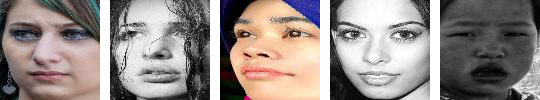
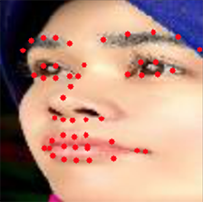

# RAF-FER
*_Facial emotion recognition on the RAF dataset_*

## Data
The [Real-world Affective Faces (RAF) Database](http://www.whdeng.cn/RAF/model1.html) is a large-scale facial expression database with around 30K diverse facial images downloaded from the Internet. This dataset contains two subsets of images: one with compound emotions and one with only 7 basic emotions (anger, disgust, fear, happiness, sadness, surprise, neutral), which we will focus on. A few image samples can be seen below.

As an input for all our models, we take the aligned version of the images (i.e. those that are already cropped by aligning to the subject's face), and upscale them to 224 x 224 pixels.

## Models created
#### VGG-SIFT-SVM
Here we combine the fc6 output of a czstomized fine-tuned [VGG-16](https://arxiv.org/abs/1409.1556) network with the SIFT descriptors of 51 facial landmarks detected on the image, and give this as input of a SVM classifier to predict the emotion. The facial landmarks are first detected using dlib and OpenCV, then the SIFT descriptors of each of the 51 landmarks are extracted. Note that we do not use the facial landmarks that lie on the border of the face, as they are irrelevant for FER. Thus we use 51 landmarks (as pictured below) instead of the 68 that dlib detects. Since each SIFT descriptors consists of 128 values, the dimension of the SIFT descriptors of a single image is 51\*128 = 6528. We use PCA to reduce this to a 1024-dimensional vector. Since the fc6 output of VGG-16 network also has dimension 1024, the total dimension of the vector representing an image is 2048.

#### SIFT-LSTM
Here, we only feed the SIFT features of the 51 facial landmarks to the SVM classifier. Like in the previous model, we apply PCA on the SIFT feature to reduce the dimensionality to 1024.

#### VGG-LSTM
Here, we only feed the fc6 output of our customized fine-tuned VGG-16 network to the SVM classifier.

### Results
To evaluate the performance of the different models, we computed the accuracy over the test set provided in the RAF database.

| Model                  | Accuracy |
|------------------------|:--------:|
| **VGG-SIFT-SVM**       |  **87%** |
| **SIFT-SVM**           |    74%   |
| **VGG-SVM**            |    86%   |

We can observe that addition of the SIFT descriptors results in a marginal improvement only.

## How to use

The code files are organized as follows:

**Main testing/training files:**
- **`vgg_sift_svm.py`**
- **`sift_svm.py`**
- **`vgg_svm.py`**

To test the accuracy of the relevant model, simply run one of these files as is, without arguments, e.g. `python vgg_sift_svm.py`. Note that this requires that you have a saved pickle file containing the pre-trained model in `models/name_of_the_model.pkl`.

To train the model from scratch, run one of these files with `train` as argument, e.g. `python vgg_sift_svm.py train`. Note that this requires that you have the RAF dataset (basic) stored in `RAF-data/`.

**Auxiliary files:**
- **`extraction.py`** - Everything related to data extraction (SIFT, VGG, ...)
- **`const.py`** - Constants used in the other files.
